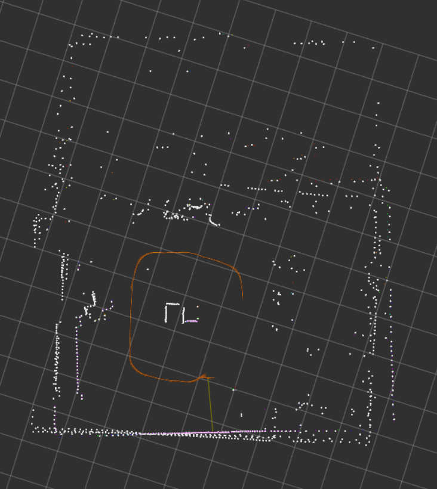

# Project 6: Naive Mapping by Waypoints

# EE5531 Introduction to Robotics

## 1. Navigation Strategy Summary (5 pts)
### Environment sketch with waypoints and landmarks
```
    +------------------+
    |                  |
    |                  |
    |  | - 3 <-|       |  B = Bin
    |  |       |       |
    |  v       |       |
    |  4   B   2       |  1-5 = Waypoints
    |  |       ^       |  Arrows = Path
    |  |       |       |
    |  ----5-> 1       |
    |                  |
    +------------------+
         North Wall
```
The mapping experiment was conducted in an indoor environment with clearly defined landmarks, including the north wall, east wall, and a centrally located recycle bin. A total of five waypoints were strategically placed to ensure good visibility of these landmarks while forming a closed-loop path to evaluate drift and map consistency. The robot starts at waypoint 1 and follows a path covering approximately 12.56 meters, returning near the starting position for loop closure analysis. At each waypoint, a specific landmark was selected for distance measurement, ensuring consistency between ground truth measurements and RViz-based evaluation.

To maintain orientation consistency, the robot’s heading was defined relative to the initial pose (facing south at waypoint 1), with subsequent orientations aligned using walls and floor tape as references. At each waypoint, the robot was carefully positioned, aligned, and stabilized before capturing scans to minimize motion-induced errors. Measurements were taken using a tape measure with an estimated uncertainty of ±0.2 m and later compared against RViz measurements. Potential challenges such as odometry drift, IMU bias, and wheel slip were mitigated using EKF-based localization and controlled robot motion, ensuring more accurate scan alignment and improved overall map quality.

## 2. System Architecture (5 pts)
### Data flow diagram

```
TurtleBot3 Hardware
    │
    ├─── /scan          (LaserScan, LDS-02 LiDAR)
    ├─── /odom          (Odometry, wheel encoders)
    └─── /imu           (IMU data)
         │
         v
  scan_capture_node
    │   ├── Subscribes: /scan, /odom (pose fallback)
    │   ├── Publishes:  /scan_capture/pointcloud (PointCloud2)
    │   └── Service:    /scan_capture/capture (CaptureScan)
         │
         v
         
  data/captures/
    ├── waypoint_N.yaml     (pose + metadata)
    └── waypoint_N.npy      (raw range array)
         │
         v
  RViz2 visualization
    └── All point clouds overlaid for map evaluation
```

### Localization Configuration (EKF/UKF configuration summary)

No external localization node was available during data collection. The `scan_capture_node` fell back to odometry poses sourced from the `/odom` topic. Pose estimates are therefore subject to wheel encoder drift with no correction mechanism — this is the primary source of error in the final map.

Dead reckoning from odometry accumulates error proportional to distance traveled. Over the ~4 m total path in this run, we observed moderate positional drift by the final waypoint, consistent with typical encoder-based odometry on the TurtleBot3 Burger (wheel slip, floor irregularities, minor IMU misalignment).

### Project 5 Sensor Characterization Integration

Project 5 sensor characterization can be incorporated into the mapping pipeline by using the LiDAR beam model to account for measurement noise and uncertainty during scan processing. Instead of treating all laser measurements equally, each beam can be filtered and weighted based on its expected noise characteristics such as 𝜎 hit and measurement bias. This allows us to reject outliers, reduce the impact of noisy readings, and generate more reliable point clouds at each waypoint. As a result, mapped features such as walls and corners become more consistent and less affected by erroneous measurements.

Additionally, the sensor characterization can be integrated into the localization pipeline by properly tuning the measurement covariance matrix in the EKF/UKF using real LiDAR noise parameters. This improves pose estimation accuracy and reduces drift, which directly enhances scan alignment across waypoints. Overall, incorporating the beam model leads to improved map accuracy, fewer artifacts such as ghosting or misalignment, and a more robust, uncertainty-aware mapping process compared to a purely geometric approach we used.


## 3. Map Accuracy Results


|Waypoint|Landmark   |Measured Distance (m)|Rviz Distance (m)|Error| Error %|
|:------:|:---------:|:-------------------:|:---------------:|:---:|:------:|
|    1   |North Wall |        1.39         |      1.41       | 0.02|  1.4  |
|    1   |Recycle Bin|        2.22         |      2.16       | 0.06|  2.7  |
|    2   |Recycle Bin|        1.62         |      1.57       | 0.05|   3   |
|    3   |Recycle Bin|        1.44         |      1.36       | 0.08|  5.6  |
|    4   |Recycle Bin|        0.96         |      0.96       | 0.00|   0   |
|    5   |North Wall |        1.39         |      1.45       | 0.06|   4.3 |
|    5   |Recycle Bin|        1.61         |      1.53       | 0.08|   5   |

Based on the measurement table, you could assume that the map accruarcy was actually okay for 5 waypoints and a single channel lidar. While the first four waypoints line up with some marginal drift in the visualization, the last one has some dramatic shift. This is due to the slip experienced when traveling to the last waypoint. There was a patch of floor where the robot got stuck and was unable to move despite the wheel's moving. This caused a point of extreme odometry drift as the robot thought it moved without actuaaly travelling. This combined with the broken localization node meant this drift would be reflected in the final map. This drift error can be seen in on the north side (bottom) of the recycle bin in the map (rectangle in center of path). The actual distances between the waypoints and landmarks did have some errors but the drift had little effect on them.

The first way to improve this map would to be to clean the floors and robot before use. While a light sweep was preformed, we stiil experienced wheel slip. The second improvement would be to pre-program a path for the robot to take. The throttle controls are not the most intuitive to use to direct the robot. Having a pre-planned path that can be tested will allow to the robot to hit each waypoint percisely where it needs to be. The third improvement would be to include a robust localization system. The localization system we used did not properly work during out data collection. With a proper localization system, the robot would be able to better correct for errors incurred from drift.

## 5. Usage Instructions
### Build Packages
1. Create a new ROS workspace and clone this repository into its src folder
2. Build the package
```
colcon build
```
3. Source the workspace
```
source install/setup.bash
```
### Capturing Data
The service can be manually called with the following:
```
ros2 service call /scan_capture/capture src/interface_pkg/srv/CaptureScan "{waypoint_id: 1, description: 'test'}"
```
Captures can also be taken with the included keyboard_capture package
```
ros2 run scan_capture_pkg keyboard_capture
# Press 1-9 for waypoint ID, or 's' for auto-increment
```
Rosbags can be recorded using typical ROS commands.

### Replaying Data
When replaying rosbags from this node, if transforms were not recorded, you must use the incuded transform pakage. To replay rosbags, follow the steps below.
1. Run the transform node
```
ros2 run scan_capture_pkg transform_node
```
2. Open a new window and run the rviz config
```
rviz2 -d src/scan_capture_pkg/config/mapping.rviz
```
3. Open another terminal tand play the rosbag. Make sure to use the `--clock` parameter.

---
